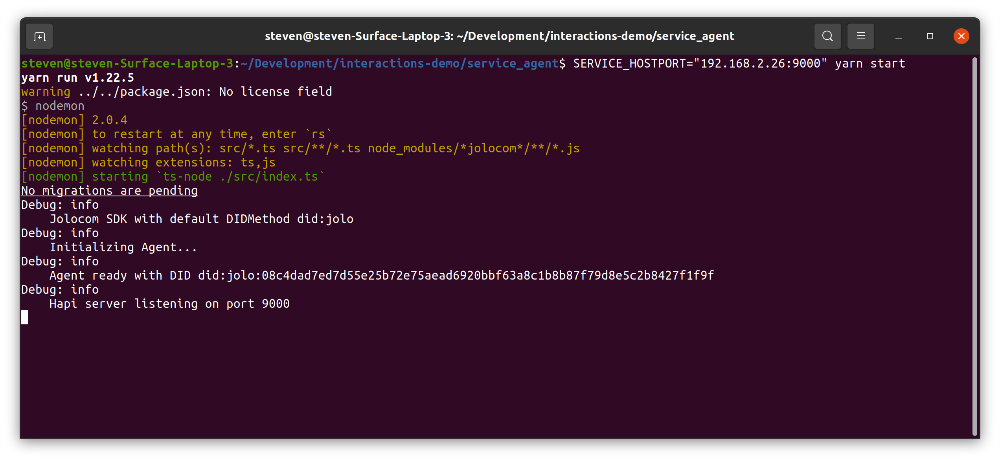

# Docker Jolocom Interactions Demo

A hosted version of this demo is available at https://interxns.jolocom.io

## Development Instructions

The docker-compose.yml provided is not suitable for development purposes,
but rather for deployment. For development please run the components manually as
described below

### Service Agent (Backend)
This requires an LTS version of Node: 10 or 12 or 14

```sh
cd service_agent
yarn install
yarn start
```

### React App (Frontend)
```sh
cd frontend
yarn install
yarn start
```
Visit the frontend development server at http://localhost:3000
and open the Web Console to see debugging output

## Deployment instructions
The repo comes with a [docker-compose.yml](./docker-compose.yml) that is
suitable for deployment accompanied by https://github.com/jolocom/docker-nginx-proxy
which automatically adds HTTPS support by issuing SSL certificates through
letsencrypt.org

The configuration for the domain is taken from environment variables in
`docker-compose.yml`
```
    LETSENCRYPT_HOST: 'interxns.jolocom.io'
    LETSENCRYPT_EMAIL: 'dev@jolocom.io'
    SERVICE_HOSTPORT: 'interxns.jolocom.io'
    VIRTUAL_HOST: 'interxns.jolocom.io'
```

### Usage with the SmartWallet

The `service_agent` needs to know its "public" facing "host:port" address to be
able to embed it in the interaction tokens, such the the SmartWallet can find
the agent.

To successfully go through the demo, change the `SERVICE_HOSTPORT` environment
variable inside `docker-compose.yml` to a value that the mobile phone can
access, probably the LAN IP address of the computer running the `service_agent`,
assuming the test SmartWallet is on the same LAN

Also note that the SmartWallet release builds require HTTP**S** connections, and cannot use
plain HTTP. To use this demo without SSL certificates please use a **staging**
build of the SmartWallet on Android, available for download here: https://jolocom.io/wp-content/uploads/smartwallet/smartwallet-staging-1.11.1.apk

### Notes from the demo explorations


Here would be the point where you set the SERVICE_HOSTPORT environment variable, basically by prefixing the command line with the variable:
```
$ SERVICE_HOSTPORT="192.168.2.26:9000" yarn start